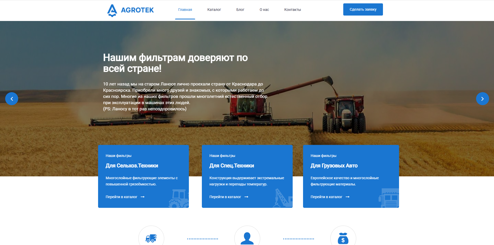
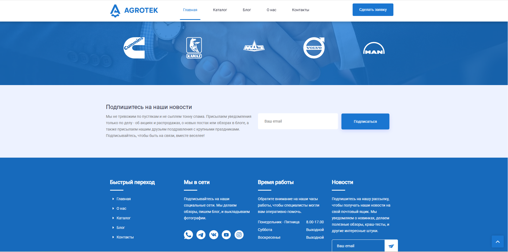
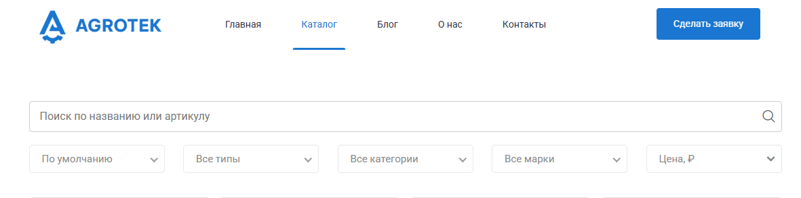
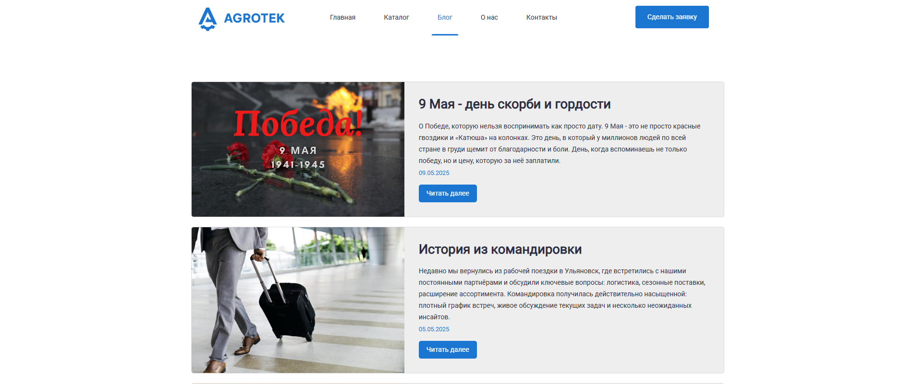
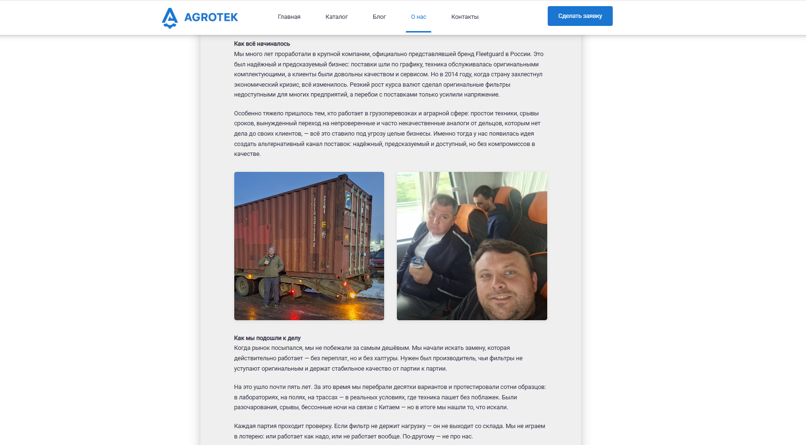
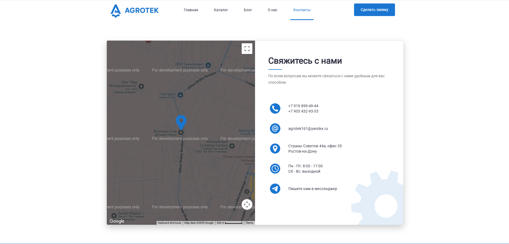
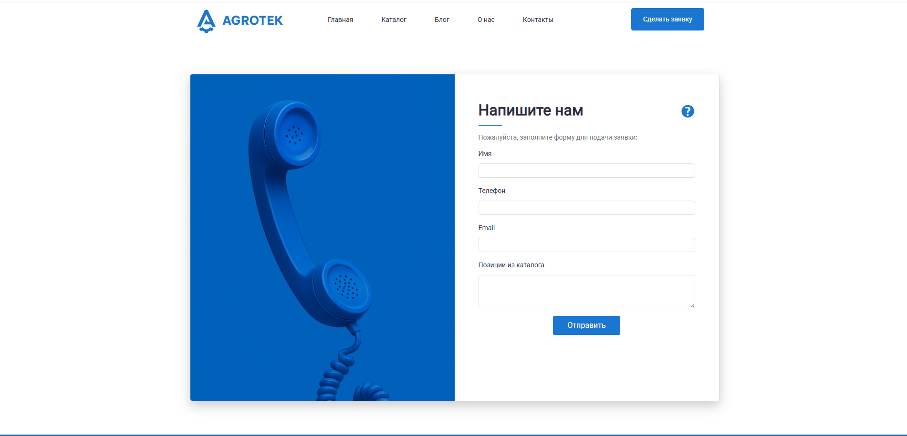
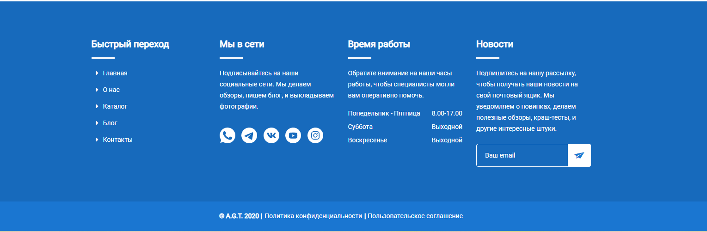

# Catalog_AGT

A web application for displaying a catalog of filters for agricultural and heavy-duty vehicles.  
Built with Flask and designed for a company specializing in filtration products.

## 🔧 Features

- Homepage with sliders and categories
- Product catalog with filtering
- Blog and company information pages
- Admin login with master password
- Application form for clients

## 📸 Screenshots

### Homepage  



### Catalog  


### Blog  


### About  



### Contacts  


### Application Form  


### Footer  


## 🚀 Getting Started

### Prerequisites

- Python 3.10+
- pip

### Installation

```bash
git clone https://github.com/SkriptSparrow/Catalog_AGT.git
cd Catalog_AGT
pip install -r requirements.txt
```

### Run the App
```bash
python main.py
```
Flask will run the project on http://127.0.0.1:5000/


🔐 Admin Access
To log in as an admin, enter the master password defined in your .env file.

📁 Project Structure
php
Copy
Edit
Catalog_AGT/
│
├── static/               # Static assets (CSS, JS, images)
│   └── screenshots/      # Screenshots for README
├── templates/            # Jinja2 templates
├── main.py               # Flask app entry point
├── requirements.txt      # Python dependencies
└── .gitignore            # Git ignore rules


👤 Author
SkriptSparrow
GitHub: SkriptSparrow
